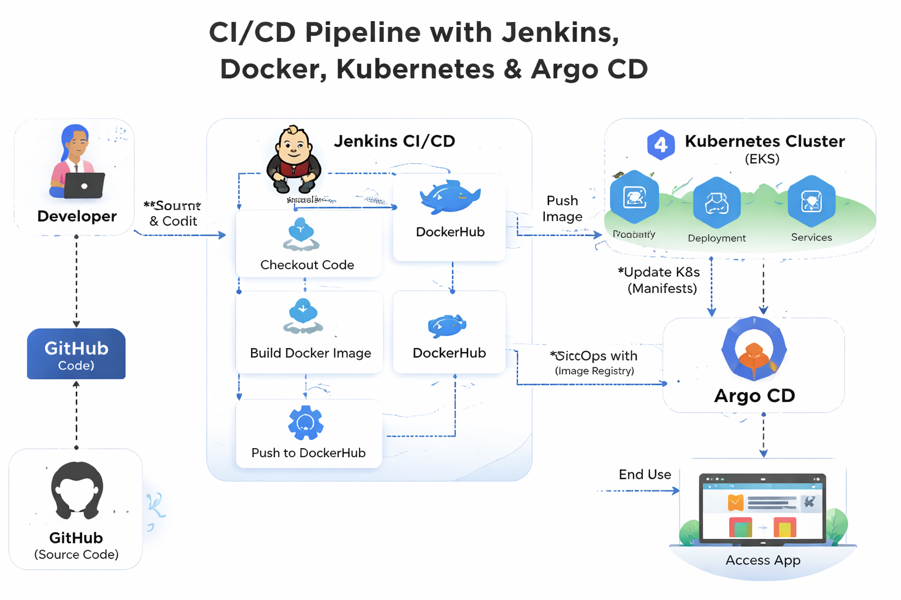

# 🚀 Production-Grade CI/CD Pipeline with Jenkins Multibranch & GitOps

## 📌 Project Overview
This project demonstrates a **production-grade CI/CD pipeline** using modern DevOps tools and practices. It automates the complete lifecycle from **code commit to production deployment**.

### 🔧 Tech Stack
- Jenkins (Multibranch Pipeline)
- Docker & DockerHub
- GitHub (Feature Branch & PR Workflow)
- Argo CD (GitOps)
- AWS EKS (Kubernetes)

---

## 🏗️ Architecture Diagram

> 📌 Make sure to upload your diagram image in the repo and name it `architecture.png`

---

## 🔄 Workflow Explanation

1. 👨‍💻 Developers push code to GitHub (feature branches / PRs)
2. 🔔 Webhook triggers Jenkins Multibranch Pipeline
3. 🏗️ Jenkins performs:
   - Build
   - Test
   - Docker Image Creation
4. 📦 Docker image pushed to DockerHub
5. 🔁 Argo CD monitors Git repository (GitOps)
6. ☸️ Deployment synced automatically to AWS EKS
7. 🌐 Application becomes live on Kubernetes cluster

---

## ✨ Key Features

- 🔄 Fully automated CI/CD pipeline  
- 🌿 Multibranch pipeline (feature, dev, main)  
- 🐳 Docker-based containerization  
- ☁️ Scalable deployment on AWS EKS  
- 🔁 GitOps model using Argo CD  
- 🔐 Secure credentials & secrets management  
- 📦 Automated Docker image build & push  

---

## ⚠️ Challenges Faced

- ⚙️ Jenkins plugin setup & pipeline configuration  
- 🔐 Managing credentials securely (AWS, DockerHub, GitHub)  
- ☸️ Kubernetes YAML debugging issues  
- 🔄 Argo CD sync & drift issues  
- 🌐 Service exposure & ingress configuration  

---

## 📚 Key Learnings

- End-to-end CI/CD pipeline design  
- Docker image optimization  
- Kubernetes deployments & services  
- GitOps workflow with Argo CD  
- AWS EKS real-world deployment  
- Debugging across DevOps tools  

---

## 🔮 Future Improvements

- 📊 Add monitoring (Prometheus & Grafana)  
- 🧪 Implement automated testing (unit + integration)  
- 🔐 DevSecOps (SAST, DAST, image scanning)  
- ⚡ Optimize pipeline performance  
- 🌍 Multi-environment setup (dev/stage/prod)  
- 📦 Use Helm charts for deployment  

---

## ✅ Conclusion

This project demonstrates how modern DevOps teams build **scalable, automated, and reliable CI/CD pipelines** using industry-standard tools.

It highlights practical implementation of:
- CI/CD Automation  
- Containerization  
- Kubernetes Orchestration  
- GitOps Deployment Strategy  

---

## 📂 Repository Structure (Example)
